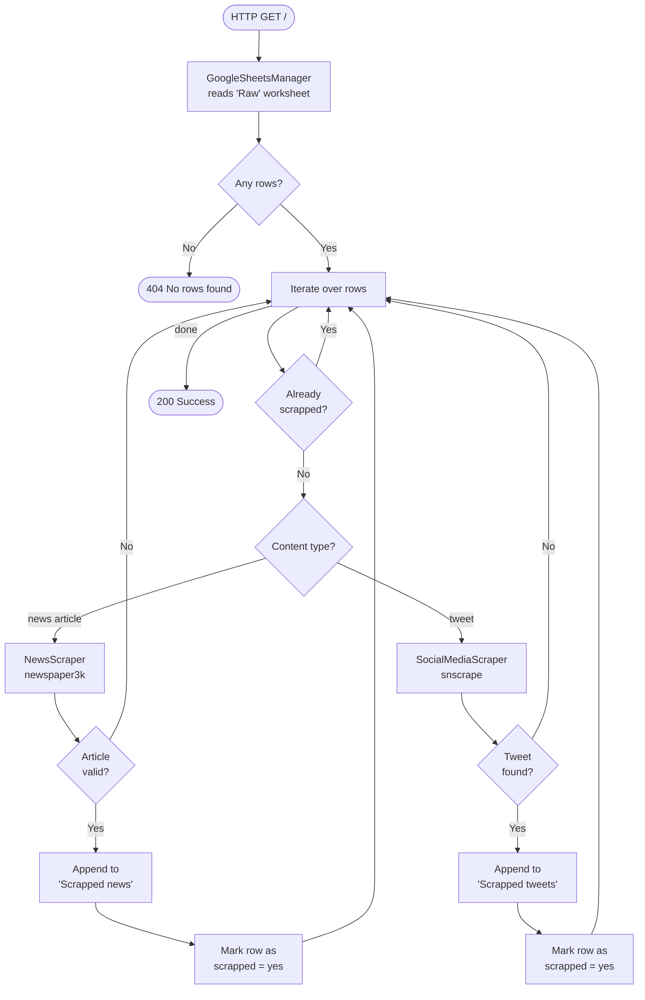
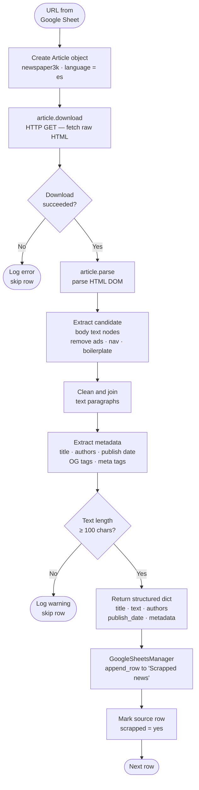

# Fake News Data Extraction

A Flask-based REST API that automatically scrapes news articles and tweets from URLs stored in a Google Sheet, extracts structured content, and writes the results back to the same spreadsheet. Built as part of a master's thesis on fake news detection.

## How it works

URLs are pre-labeled in a Google Sheet ("Raw" worksheet) with a type (`news article` or `tweet`) and a category. On each request to `GET /`, the service iterates over unprocessed rows, scrapes each source, and appends the extracted data to the corresponding output worksheet, then marks the row as processed.



### Article scraping pipeline

When a row is identified as a `news article`, the following steps happen inside `NewsScraper.parse_article()`:



**Key steps explained:**

| Step | Library call | What it does |
|---|---|---|
| Download | `article.download()` | Sends an HTTP GET, stores raw HTML in memory |
| Parse DOM | `article.parse()` | Runs newspaper3k's content extractor — strips navigation, ads, and boilerplate using heuristics |
| Text extraction | internal | Joins candidate paragraph nodes into clean plain text |
| Metadata extraction | internal | Reads `<title>`, byline patterns, `<meta>` / Open Graph tags for authors and publish date |
| Validation | custom | Rejects articles whose body text is shorter than 100 characters |
| Persist | `append_row()` | Writes one row to the "Scrapped news" worksheet via the Sheets API |

### Google Sheet structure

| Worksheet | Purpose |
|---|---|
| `Raw` | Input — one URL per row with `url`, `type`, `category`, and `scrapped` columns |
| `Scrapped news` | Output — title, text, authors, publish date, URL, metadata, category |
| `Scrapped tweets` | Output — text, username, date, URL, category |

## API Endpoints

| Method | Path | Description |
|---|---|---|
| `GET` | `/` | Run the scraping pipeline |
| `GET` | `/dataset` | Return all scraped data as JSON |
| `GET` | `/health` | Validate configuration |

## Setup

### Prerequisites

- Python 3.9+
- A Google Cloud service account with access to the target spreadsheet
- The spreadsheet URL shared with the service account email

### Installation

```bash
pip install -r requirements.txt
```


### Running

**Development:**
```bash
python main.py
```

**Production:**
```bash
gunicorn main:app
```

## Project structure

```
.
├── app/
│   ├── __init__.py              # App factory, CORS, blueprint registration
│   ├── config.py                # Environment-based configuration and service account loader
│   ├── routes.py                # Scraping and dataset endpoints
│   ├── services/
│   │   └── flask_server.py      # Flask server abstraction
│   └── tools/
│       ├── google_sheets_manager.py  # gspread wrapper (read/write/update cells)
│       ├── news_scraper.py           # newspaper3k article parser
│       └── social_media_scraper.py   # snscrape tweet fetcher
├── main.py
├── requirements.txt
└── README.md
```

## Dependencies

| Library | Purpose |
|---|---|
| `Flask` | Web framework |
| `gunicorn` | Production WSGI server |
| `gspread` | Google Sheets API client |
| `newspaper3k` | News article scraping and NLP |
| `snscrape` | Twitter/X scraping without API keys |
| `python-dotenv` | `.env` file loading |
| `flask-cors` | Cross-origin request support |
